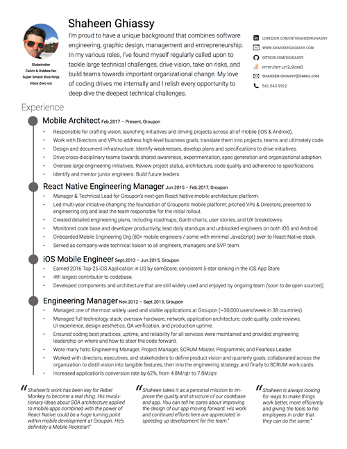

# Shaheen Ghiassy's Homepage

Hi, welcome to my website. I like `git` and the `CLI`, thus the use of this repo as my personal homepage.

## Resume

[LinkedIn](https://www.linkedin.com/in/shaheenghiassy) functions as my digitial resume. 

Or you can download the PDF format of my resume: [Shaheen-Ghiassys-Resume.pdf](./src/pdf/Shaheen-Ghiassys-Resume.pdf)

## Design Portfolio

I used to be a graphic designer way back when. I'm still really proud to be a software engineer that has a design portfolio - but design is no longer my forte.

<a href=./src/pdf/Shaheen-Ghiassys-Portfolio.pdf>
    Shaheen-Ghiassys-Portfolio.pdf (22.5 MB)]
    
</a>

## Links

- [LinkedIn](https://www.linkedin.com/in/shaheenghiassy)
- [Twitter](https://twitter.com/shaheenghiassy)
- [Medium](https://medium.com/@shaheenghiassy)
- [Pinterest](https://www.pinterest.com/sghiassy/)